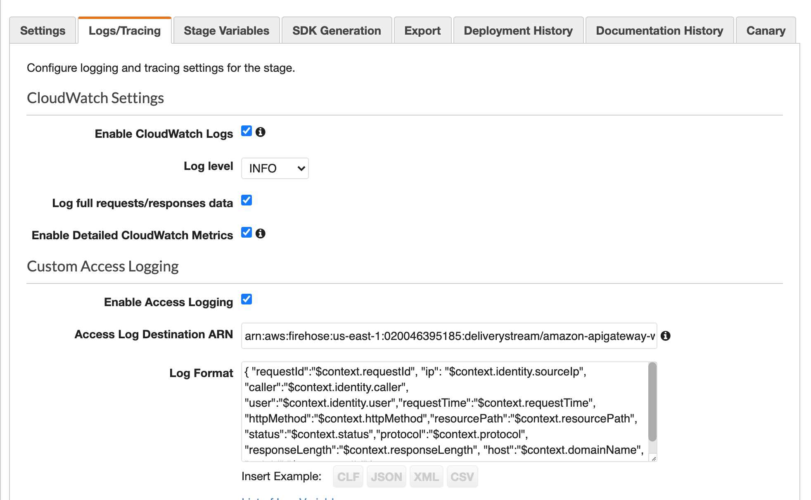

# Api logs visualization

### Aim of the project
The aim is to visualize the logs of api-gateway recived by Cloudwatch.

### Aws Services Used
1- Api-gateway

2- Cloudwatch

3- Kinesis Firhose

4- S3

5- Athena

6- QuickSight

### Steps to Follow:

#### 1. Create the s3 bucket
Create the bucket in which the logs will be stored.

#### 2. Firehose 
Create the Firehose delivery stream and give the source to the previously created s3 bucket.
Make sure the Firhose Delivery stream name must have `amazon-apigateway` before the delivery stream name i.e. `amazon-apigateway-{your-delivery-stream-name}`

#### 3. Api-Gateway 

Make sure the api is deployed.
Then click on stages and enable the logs. Follow the settings below:



Add the arn of firehose. In order to send logs to Kinesis-Firehose.

#### 4. Athena
Create the database and then create the Athena table.

```
CREATE EXTERNAL TABLE `s3_access_logs_db.logs2`(
  `requestId` STRING,
  `ip` STRING,
  `caller` STRING,
  `user` STRING,
  `requestTime` STRING,
  `httpMethod` STRING,
  `resourcePath` STRING,
  `status` STRING,
  `protocol` STRING,
  `httpstatus` STRING,
  `responseLength` STRING
  `api_id` STRING)
ROW FORMAT SERDE 'org.openx.data.jsonserde.JsonSerDe'
LOCATION
  's3://quicksight-wahaj/exported2021/'
```
After creating this, Don't forget to create the workergroup in Athena as quicksight support athena workergroup

#### 5. QuickSight

1- Signup on the QuickSight

2- Make sure that Quicksight have access to Athena

3- Then go to Analysis and from top right corner click on new analysis then click new dataset

4- Select Athena from the options

5- Add the workergroup

6- Click on create datasource
